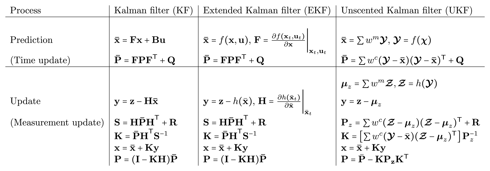

# kf_cpp
ROS 2 C++ implementation of Extended Kalman filter (EKF) and Unscented Kalman filter (UKF) with demo nodes.

## Table of Contents

- [kf\_cpp](#kf_cpp)
  - [Table of Contents](#table-of-contents)
  - [Installation](#installation)
    - [Prerequisites](#prerequisites)
      - [Dependencies from `CMakeLists.txt`](#dependencies-from-cmakeliststxt)
  - [KF v.s. EKF v.s. UKF](#kf-vs-ekf-vs-ukf)
  - [Bibliography](#bibliography)
  - [Acknowledgements](#acknowledgements)
  - [Contact](#contact)


## Installation

This repository is ROS 2-based and utilises several dependencies that are common in robotics applications. Follow the instructions below to build the package in a ROS 2 environment.

### Prerequisites

Make sure you have the following installed:

- **ROS 2 humble**: Installed and properly sourced. Follow the [ROS 2 installation guide](https://docs.ros.org/en/humble/Installation.html) if you haven't set it up yet.
- **C++17 Compiler**: Ensure your compiler supports C++17.
- **Dependencies**: The package depends on several libraries and ROS 2 packages.

#### Dependencies from `CMakeLists.txt`

- `Eigen3`
- ROS 2 packages:
  - `rclcpp`

Clone this repo into your ROS 2 workspace, install dependencies, and build pkg:

```bash
cd ~/ros2_ws/src && git clone https://github.com/wei-hsuan-cheng/kf_cpp.git

cd ~/ros2_ws && rosdep update && rosdep install --from-paths src --ignore-src -r -y

cd ~/ros2_ws && colcon build --packages-select kf_cpp && . install/setup.bash
```

Run the ROS 2 node for test:

```bash
cd ~/ros2_ws && . install/setup.bash
ros2 run kf_cpp ukf_ori_sim
```


## KF v.s. EKF v.s. UKF

The table below compares the process of each filter in each iteration.




## Bibliography
- EKF:
  - [1]
- UKF:
  - [1] Rudolph Van der Merwe. "Sigma-Point Kalman Filters for Probabilistic Inference in Dynamic State-Space Models" dissertation (2004).

  - [2] Simon J. Julier. "The Scaled Unscented Transformation". Proceedings of the American Control Conference 6. IEEE. (2002)

  - [3] http://www.esdradar.com/brochures/Compact%20Tracking%2037250X.pdf

  - [4] Julier, Simon J.; Uhlmann, Jeffrey "A New Extension of the Kalman  Filter to Nonlinear Systems". Proc. SPIE 3068, Signal Processing, Sensor Fusion, and Target Recognition VI, 182 (July 28, 1997)

  - [5] Cholesky decomposition. Wikipedia. http://en.wikipedia.org/wiki/Cholesky_decomposition

## Acknowledgements

- **Kalman-and-Bayesian-Filters-in-Python**: The EKF algorithm is an C++ implementation adapted from the [Kalman-and-Bayesian-Filters-in-Python](https://github.com/rlabbe/Kalman-and-Bayesian-Filters-in-Python).
- **hdl-localization-ROS2**: The UKF algorithm is adapted from the [hdl-localization-ROS2 codebase](https://github.com/pyc5714/hdl-localization-ROS2/blob/35de917029371c4de93fc8107ad25a09cca7b238/hdl_localization/include/kkl/alg/unscented_kalman_filter.hpp#L241).
- **Robot Math Utils**: Some utilities from [Robot Math Utils](https://github.com/wei-hsuan-cheng/robot_math_utils) is used.
- **Eigen Library**: This library heavily relies on the Eigen library for linear algebra operations.

## Contact

- **Author**: Wei-Hsuan Cheng [(johnathancheng0125@gmail.com)](mailto:johnathancheng0125@gmail.com)
- **GitHub**: [wei-hsuan-cheng](https://github.com/wei-hsuan-cheng)


